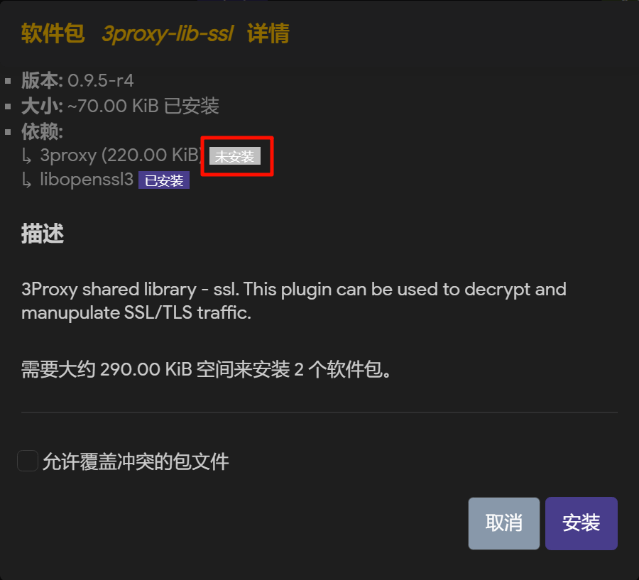

# 🧠cqu校园网多设备限制的解决方案

## 📚 目录
- [一、 背景](#背景)
- [二、 解决思路与准备](#解决思路与准备)
- [三、 操作过程](#操作过程)
- [四、 更新记录](#更新记录)

---
---

## 一、 背景🏫
由于cqu校园网限制多设备，但我有一些小智能家居需要连接网络，所以我开始折腾如何破解这种限制。  
在折腾过程中本人走了很多弯路，所以在这里给各位分享一下我的一些经验与避坑。  
希望能帮到和我一样有类似需求的同学们，少走弯路。  
本人并不是计算机相关专业人士，如果有错误，希望大家海涵。

---
---

## 二、 解决思路与准备⚙️
通过查找相关资料，我最终采用路由器刷入**immortalwrt**来实现需求。  

如果想要跟着我这篇教程走，那么你需要：

| 内容 | 要求 |
|:------:|:------:|
| 路由器 | **能够刷机**，我使用的是一台xiaomi cr8809 |
| 网线 | 至少一根，两根最好 |
| 手机 | 能够正常使用，能用热点（以防万一） |
| 其他 | 正常的动手能力、坚持不懈的精神 |

---
---

## 三、 操作过程🛠

### （一） 路由器刷入openwrt或者immortalwrt🧩
这一步网络上有许多教程，大家可以自行刷入，这里不多赘述。
大家可以在[bilibili](www.bilibili.com)、[恩山无线论坛](https://www.right.com.cn/forum/)、[oepnwrt](https://github.com/openwrt/openwrt)、[immortalwrt](https://github.com/immortalwrt/immortalwrt)、[x_wrt](https://x-wrt.com/)进行相关搜索。

如果你使用的也是cr8809，你可以观看[视频（点击跳转）](https://www.bilibili.com/video/BV1JoYdztE4L/?share_source=copy_web&vd_source=661e0f5132548578c578dcdf87b29448)进行刷机，在刷入immortalwrt固件时尝试下载我的固件
（**并不保证能够正常使用！！！**）  

我采用的是 **ua2f** + **ttl** 的方案，这俩就足够了。  

可以参考这两篇文章启用的插件和依赖：  
https://blog.krytro.com/blogs/daily/240322.html
https://waternorth.cn/2025/07/23/CQU%E6%A0%A1%E5%9B%AD%E7%BD%91%E8%A7%A3%E5%86%B3%E6%96%B9%E6%A1%88/

快速构建openwrt固件网站：  
https://openwrt.ai/?target=x86%2F64&id=generic

官方固件下载网址：  
- OpenWrt: https://firmware-selector.immortalwrt.org/  
- ImmortalWrt: https://firmware-selector.immortalwrt.org/

自己编译固件参考：  
https://www.bilibili.com/video/BV1pep4zsE2A/

---

### （二） 基本设置🧩
如果你已经成功刷入immortalwrt/openwrt，接下来进行以下操作：

#### 网络连接
1. 第一根网线，一头连接**学校网口**，另一头连接路由器**WAN口**  
2. 然后有两种方法（任选其一）：
   - 使用第二根网线，一头连接路由器**LAN口**，一头连接电脑网口（电脑没有网口？买一个转接器）
   - 电脑连接无线网络，名称为**immortalwrt**（无密码）

**（这一部分我并不确定是否正确，但是我当时是这样进行的）**

#### 登录管理后台
1. 打开浏览器，输入 `192.168.1.2`（可能不同）进入路由器后台
2. 登录：用户名 `root`，首次无密码，直接回车（这里我用了主题，界面不太一样，无伤大雅）


3. 根据界面提示设置密码，后续登录时需要该密码

#### ssh访问
使用软件（示例使用 **MobaXterm**）：
   - 下载地址：https://mobaxterm.mobatek.net/download.html  
   - 视频教程：https://www.bilibili.com/video/BV1begezWESE/?share_source=copy_web&vd_source=661e0f5132548578c578dcdf87b29448&t=417

immortalwrt如果安装了 `ttyd` 插件，可直接在路由器后台使用终端；或者windows 命令行`ssh 用户名@IP地址`，这两种方法我没尝试过。

这篇文章我使用**MobaXterm**来操作。

---

#### **UA2F 设置**
终端输入以下命令启用 UA2F：

```bash
uci set ua2f.enabled.enabled=1
uci set ua2f.firewall.handle_fw=1
uci set ua2f.firewall.handle_intranet=1
uci commit ua2f
service ua2f enable
service ua2f start
```

相关命令可以参考：https://github.com/Zxilly/UA2F

---

#### **TTL 固定**
#### a. iptables 方法
如果你的openwrt版本相对较老，这一步非常简单，终端输入:
```
iptables -t mangle -A POSTROUTING -j TTL --ttl-set 128
```

#### b. nftables 方法
这种适用于相对较新的openwrt版本
1. 进入规则目录：`cd /etc/nftables.d`
2. 新建规则文件：`vi 12-mangle-ttl-128.nft`
3. 按 `I` 进入编辑模式，粘贴以下内容：

```
chain mangle_postrouting_ttl128 {
  type filter hook postrouting priority 300; policy accept;
  counter ip ttl set 128
}

chain mangle_prerouting_ttl128 {
  type filter hook prerouting priority 300; policy accept;
  counter ip ttl set 128
}
```

4. 先按键盘上的 **Esc** 退出编辑模式，再输入 **:wq**回车退出并保存文件。

1-4步你也可以不用代码创建，手动进入目录，手动创建文件，粘贴代码，然后保存即可


5. 重启防火墙：

```
service firewall restart
```

参考文章：https://www.hetong-re4per.com/posts/multi-device-detection/


### （三）测试
#### **网络连接测试**
建议先重启一下路由器。在重启完成之后，连接网络（连接无线网络的话，wifi密码可以在`网络 无线 无线概况`里进行设置，我的界面可能和大家不一样，大家可以自行上网搜索一下）


浏览器输入`10.10.8.162`，如果能出现cqu校园网的登录页面，那么就大功告成了！！！输入你的账号密码，开始上网吧！！！

网页进不去？可以参考这篇文章：https://www.zouht.com/4107.html

#### ***UA2F 测试***
1. 打开 http://ua-check.stagoh.com/  
2. 判断结果：
   - 第一个框全为 `FFFFFF`  
   - 最后一个框显示 `正在工作` 
    
如果你和我的结果一样，恭喜你配置成功！！！


和我显示的不一样？

可以参考:https://www.right.com.cn/FORUM/thread-8384792-1-1.html

---

#### **TTL 测试**
终端输入：
```bash
ping www.bilibili.com
```
TTL 为 **128** 表示配置成功！！！


---

#### 自动登录
为了防止校园网账号意外下线，导致断网，也可按照下文操作：

这段命令需要你有 **curl** 的插件，没有怎么办？
1. 路由器管理后台点击`系统 软件包 配置opkg`


2. 最后一个框，可以修改为国内的镜像源（清华源、腾讯源等等），只需要修改每一行`https://【xxxxxx】/releases/` 里【】部分的内容就可以了，大家可以自行搜索。


3. 点击`更新列表`稍等待一会（这一步需要你联网，可以手机开热点给电脑用）,搜索 **curl**，进行安
（**如果有前置依赖没有安装，请先去安装前置依赖！！！**）




ua2f其实也可以在个界面进行安装。（还是要看依赖，如果你怎么都不到前置的依赖，那就换一个固件吧）

现在你应该已经安装好`curl`了，那我们继续：

```
* * * * * curl --connect-timeout 10 https://baidu.com || curl "http://10.254.7.4:801/eportal/portal/login?callback=dr1004&login_method=1&user_account=%2C0%2C【在这里填写账号】&user_password=【在这里填写密码】&wlan_user_ip=$(ifconfig 【在这里填写路由器的WAN口网卡号】 | grep 'inet addr:' | grep -oE '[0-9]{1,3}\.[0-9]{1,3}\.[0-9]{1,3}\.[0-9]{1,3}' | head -n 1)&wlan_user_ipv6=&wlan_user_mac=000000000000&wlan_ac_ip=&wlan_ac_name=&ua=Mozilla%2F5.0%20(Windows%20NT%2010.0%3B%20Win64%3B%20x64)%20AppleWebKit%2F537.36%20(KHTML%2C%20like%20Gecko)%20Chrome%2F139.0.0.0%20Safari%2F537.36&term_type=1&jsVersion=4.2&terminal_type=1&lang=zh-cn&v=2992&lang=zh"
```

将上述代码替换为自己的信息之后，（路由器的WAN口网卡一般就是wan），复制粘贴到 `系统-计划任务`即可


下面的另一个命令是路由器自动重启的命令，大家按需也可使用。

参考文章：
https://www.zouht.com/4107.html

## 四、 更新记录🗓

| 日期 | 更新内容 |
|------|-----------|
| 2025-10-23 | 初版发布 |

---

💡 **欢迎交流**  
本人也不是大佬，也是一个一个坑踩过来的，感谢我文章中链接里的大佬！！！
如果本人文章内容存在问题，希望大家多海涵，也希望大家能及时提出，我尽快改正。

如果操作过程中遇到问题，可以先思考，然后询问 AI，或者与我联系！

---

📜 License: [MIT](LICENSE)

